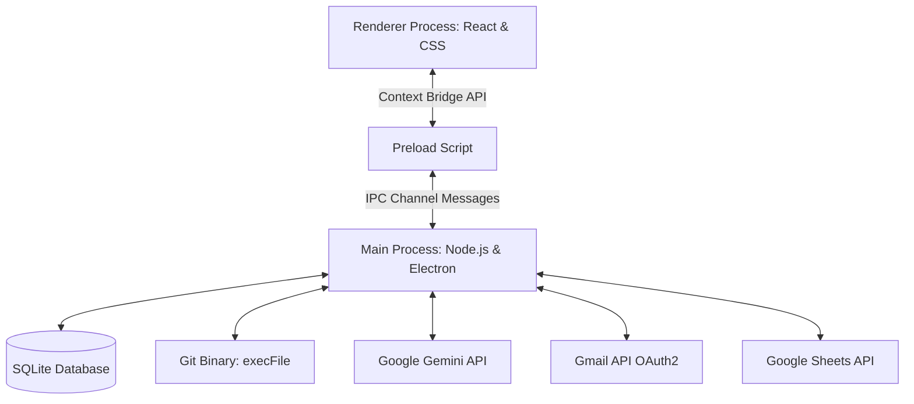

# Architecture Design

Thalavedana is built as a local-first desktop automation assistant using Electron, React, TypeScript, and SQLite.

## Process Architecture

The application is structured into three main process boundaries:

### 1. Main Process (`electron/main/`)
- Acts as the secure backend, running on Node.js.
- Coordinates database storage, file system operations, execution of native CLI binaries (`git`), and external API calls (Gemini LLM, Gmail OAuth).
- Runs the background cron schedule and startup recovery loops.

### 2. Preload Script (`electron/preload/index.ts`)
- Restricts direct Node.js integration inside the web view for security compliance.
- Exposes a minimal, hardened API bridge (`window.thalavedana`) using Electron's `contextBridge` and `ipcRenderer`.

### 3. Renderer Process (`src/renderer/`)
- Represents the user interface built in React, TypeScript, and custom CSS.
- Completely sandboxed; communicates with the system solely through the exposed API bridge.

---

## Security Boundaries & Design

1. **Local-First Database & Cryptography**:
   - All settings, repositories, daily reports, and system logs are stored inside a local SQLite database (`thalavedana.db`) inside the application's secure data directory.
   - Sensitive credentials (Gemini API keys, Gmail refresh tokens, Client Secrets) are encrypted at rest using AES-256 via Electron's native `safeStorage` API. On Linux, this automatically integrates with the system keyring (GNOME Keyring / KWallet).

2. **Zero-Shell Git Execution**:
   - Commands to parse Git commits are spawned using `execFile` rather than `exec`. 
   - Repository paths and arguments are passed as discrete string arrays, which prevents shell-injection vulnerabilities.

3. **CSRF-Protected OAuth Flow**:
   - The loopback server used for the Gmail authentication callback validates a cryptographically secure random `state` token on every redirection to prevent OAuth hijacking.
