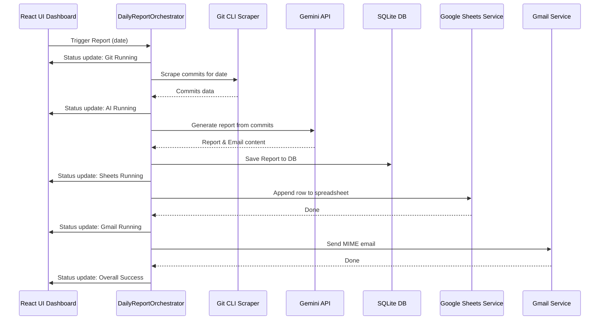

# Report Generation Pipeline & Workflow

The daily report workflow is coordinated by the `DailyReportOrchestrator` in a strict 4-stage pipeline.

## Detailed Execution Steps

### 1. Git Scrape Stage
- Reads all configured repositories from the database.
- Runs `git log` securely for the specified date.
- Collects commit hashes, author names, descriptions, changed files, and patch diffs.
- Aborts early if zero commits are found, marking the run as skipped.

### 2. AI Synthesis Stage
- Compiles the commit diffs and metadata into a prompt template.
- Sends the payload to the Gemini API.
- Receives structured JSON containing:
  - **Daily Report**: A detailed, bulleted markdown log of tasks, changes, and milestones.
  - **Email Subject**: A professional title.
  - **Email Body**: A polite, complete email ready to send.

### 3. Google Sheets Log Stage
- Connects securely to the Google Sheets API using the existing OAuth credentials.
- Locates the spreadsheet by extracting the spreadsheet ID from the saved URL.
- Detects column mapping and appends today's summary to the next empty row, preserving sheet formulas and styles.

### 4. Gmail Dispatch Stage
- Generates an RFC 2822 compliant MIME email.
- Uses OAuth2 to send the email directly via Google's `gmail.users.messages.send` API endpoint.
- Persists refreshed tokens in the SQLite database automatically.

## Runtime Status Model
- The orchestrator emits live updates over IPC channel `orchestrator:status-change`.
- Each stage (`git`, `ai`, `excel`, `gmail`) reports `idle`, `running`, `success`, or `failed`.
- The top-level `overall` state transitions through `idle` -> `running` -> `success` or `failed`.
- The renderer can fetch current state on demand using `orchestrator:get-status`.

## Failure and Recovery Behavior
- If no repositories are configured, the run fails immediately in stage 1.
- If commits are empty and manual notes are also empty, the app generates a safe default fallback report.
- If AI generation fails, Sheets and Gmail are skipped and the run is marked failed.
- Partial failures are persisted in SQLite so they can be retried from the dashboard.
- Manual stage retries are supported for report runs through targeted retry actions.
