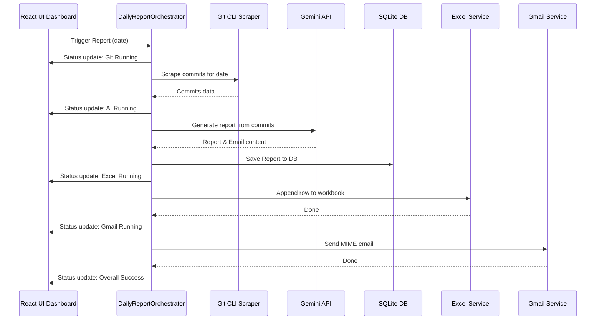

# Report Generation Pipeline & Workflow

The daily report workflow is coordinated by the `DailyReportOrchestrator` in a strict 4-stage pipeline.

## Detailed Execution Steps

### 1. Git Scrape Stage
- Reads all configured repositories from the database.
- Runs `git log` securely for the specified date.
- Collects commit hashes, author names, descriptions, changed files, and patch diffs.
- Aborts early if zero commits are found, marking the run as skipped.

### 2. AI Synthesis Stage
- Compiles the commit diffs and metadata into a prompt template.
- Sends the payload to the Gemini API.
- Receives structured JSON containing:
  - **Daily Report**: A detailed, bulleted markdown log of tasks, changes, and milestones.
  - **Email Subject**: A professional title.
  - **Email Body**: A polite, complete email ready to send.

### 3. Excel Log Stage
- Loads the configured spreadsheet template using `exceljs`.
- Locates the specified sheet.
- Appends a new row mapping dates, repository names, and markdown summaries into columns matching the user's custom mappings.

### 4. Gmail Dispatch Stage
- Generates an RFC 2822 compliant MIME email.
- Uses OAuth2 to send the email directly via Google's `gmail.users.messages.send` API endpoint.
- Persists refreshed tokens in the SQLite database automatically.
